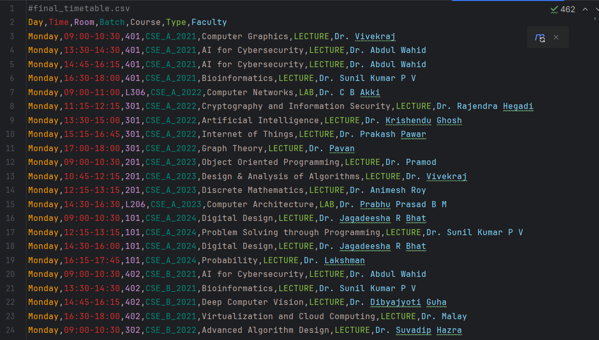

# Automatic Timetable Scheduler

## Overview
The **Automatic Timetable Scheduler** is a comprehensive Java-based project designed to generate optimized and conflict-free timetables for academic institutions. Using **OptaPlanner**, the project ensures that all scheduling constraints are met while balancing faculty workloads, student requirements, and room availability. This project emphasizes the use of Object-Oriented Programming (OOP) principles and advanced Java techniques, providing a robust foundation for solving real-world scheduling problems.

## Key Features

- **Constraint-Based Optimization**: Leverages OptaPlanner to solve scheduling problems with hard and soft constraints.
- **Support for Diverse Entities**: Includes Courses, Faculties, Student Batches, Rooms, Lessons, and Time Slots.
- **Enhanced Room Types**: Handles various room types such as lecture rooms, computer labs, and hardware labs.
- **Flexible Scheduling**: Supports minor courses and ensures their compatibility with time slots and rooms.
- **Balanced Workload**: Ensures equitable distribution of teaching hours among faculty.
- **Conflict-Free Schedules**: Avoids overlapping sessions for faculty, rooms, and student batches.
- **CSV Integration**: Enables easy data import/export for courses, faculty, rooms, and schedules.

---

## Project Structure

### Classes

#### **Course**
```java
public class Course {
    private Long id;
    private String courseCode;
    private String name;
    private String courseType; // Regular or elective
    private List<Integer> batchIds; // Batch identifiers
    private int lectureHours;
    private int theoryHours;
    private int practicalHours; // Hours for practical sessions
    private int credits;
    private int hoursPerWeek; // Calculated from lecture, theory, and practical hours
    private List<Faculty> eligibleFaculty; // Faculty eligible to teach the course
    private List<Long> lectureRoomIDs; // Specific to minors
    private boolean isMinor;
}
```

#### **Faculty**
```java
public class Faculty extends User {
    private List<String> subjects;
    private List<TimeSlot> preferredSlots;
    private int maxHoursPerDay;
    private boolean isAvailable;
    private List<Lesson> assignedLessons;

    // Constructor
    public Faculty(Long id, String name, String email, String password, List<String> subjects, int maxHoursPerDay) {
        super(id, name, email, password);
        this.subjects = subjects;
        this.maxHoursPerDay = maxHoursPerDay;
        this.isAvailable = true;
        this.assignedLessons = new ArrayList<>();
        this.preferredSlots = new ArrayList<>();
    }
}
```

#### **Lesson**
```java
@PlanningEntity
public class Lesson {
    @PlanningId
    private Long id;
    private Course course;
    private StudentBatch studentBatch;
    private String lessonType;
    private Faculty faculty;
    private Room room;

    @PlanningVariable(valueRangeProviderRefs = "timeSlotRange")
    private TimeSlot timeSlot;

    private List<Room> roomList;
}
```

#### **Room**
```java
public class Room {
    private Long id;
    private String roomNumber;
    private int capacity;
    private RoomType roomType;
    private boolean isAvailable;
}
```

#### **RoomType**
```java
public enum RoomType {
    LECTURE_ROOM,
    COMPUTER_LAB,
    HARDWARE_LAB,
    SEATER_120,
    SEATER_240;

    public boolean isLabRoom() {
        return false;
    }
}
```

#### **StudentBatch**
```java
public class StudentBatch {
    private Long id;
    private String batchName;
    private int year;
    private int strength;
    private List<Course> courses;
    private List<Long> lectureRoomIDs;
    private List<Long> practicalRoomIDs;

    public StudentBatch(Long id, String batchName, int year, int strength, List<Course> courses, List<Long> lectureRoomIDs, List<Long> practicalRoomIDs) {
        this.id = id;
        this.batchName = batchName;
        this.year = year;
        this.strength = strength;
        this.courses = courses != null ? courses : new ArrayList<>();
        this.lectureRoomIDs = lectureRoomIDs != null ? lectureRoomIDs : new ArrayList<>();
        this.practicalRoomIDs = practicalRoomIDs != null ? practicalRoomIDs : new ArrayList<>();
    }
}
```

#### **TimeSlot**
```java
public class TimeSlot {
    private Long id;
    private String day;
    private LocalTime startTime;
    private LocalTime endTime;
    private String slotType;

    public TimeSlot(Long id, String day, LocalTime startTime, LocalTime endTime, String slotType) {
        this.id = id;
        this.day = day;
        this.startTime = startTime;
        this.endTime = endTime;
        this.slotType = slotType;
    }
}
```

---

### OptaPlanner Integration

#### **TimeTable**
```java
@PlanningSolution
public class TimeTable {
    private Long id;

    @PlanningEntityCollectionProperty
    private List<Lesson> lessonList;

    @ProblemFactCollectionProperty
    @ValueRangeProvider(id = "facultyRange")
    private List<Faculty> facultyList;

    @ProblemFactCollectionProperty
    @ValueRangeProvider(id = "roomRange")
    private List<Room> roomList;

    @ProblemFactCollectionProperty
    @ValueRangeProvider(id = "timeSlotRange")
    private List<TimeSlot> timeSlotList;

    @PlanningScore
    private HardSoftScore score;

    public TimeTable(Long id, List<Lesson> lessonList, List<Faculty> facultyList, List<Room> roomList, List<TimeSlot> timeSlotList) {
        this.id = id;
        this.lessonList = lessonList;
        this.facultyList = facultyList;
        this.roomList = roomList;
        this.timeSlotList = timeSlotList;
    }
}
```

#### **TimeTableConstraintProvider**
```java
public class TimeTableConstraintProvider implements ConstraintProvider {
    @Override
    public Constraint[] defineConstraints(ConstraintFactory factory) {
        return new Constraint[] {
                roomConflict(factory),
                teacherConflict(factory),
                studentGroupConflict(factory),
                roomCapacity(factory),
                teacherQualification(factory),
                weeklyLabScheduling(factory),
                balanceFacultyLoad(factory),
                minimizeGapsInSchedule(factory)
                // and many more
        };
    }
}
```

---

## Data Loading
**CSVDataLoader** provides utility methods for importing data:

- `loadFaculty(String csvFile)`
- `loadRooms(String csvFile)`
- `loadCourses(String csvFile, List<Faculty> facultyList)`
- `loadStudentBatches(String csvFile, List<Course> courseList)`

---

## Usage

1. **Set Up Data**: Prepare CSV files for faculties, rooms, courses, and student batches.
2. **Run Solver**:
    ```java
    SolverFactory<TimeTable> solverFactory = SolverFactory.create(new SolverConfig());
    TimeTable solution = solver.solve(problem);
    ```
3. **Export Solution**: Save the generated timetable to a CSV file.

---

## Running the Project Using IntelliJ IDEA

To run the **Automatic Timetable Scheduler** project using IntelliJ IDEA:

1. **Open the Project**:
    - Launch IntelliJ IDEA.
    - Click on **File > Open** and select the project's root directory.

2. **Import Dependencies**:
    - Ensure that the required dependencies are listed in the `pom.xml` or `build.gradle` file.
    - IntelliJ IDEA will prompt you to import or refresh the project dependencies.

3. **Build the Project**:
    - Click on **Build > Build Project** or press `Ctrl+F9` (Windows/Linux) or `Cmd+F9` (macOS).

4. **Run the Application**:
    - Navigate to the main class **TimeTableApp** containing the `public static void main(String[] args)` method.
    - Right-click on the file and select **Run**.

5. **View Results**:
    - Check the console output or generated files for the timetable solution.

---

## Execution Samples

Screenshots of the sample executions:

- **Input Data**: 


- **Console Logs**:


- **Generated Timetable**: 





